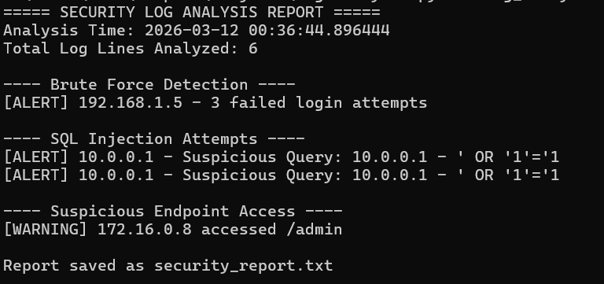
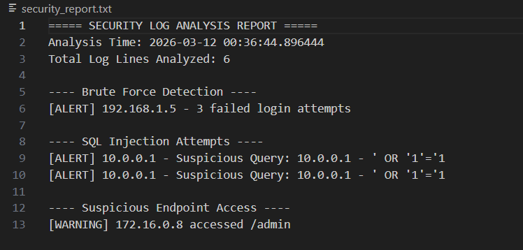

# Security Log Analyzer (Python)

A lightweight security log analysis tool written in Python that detects suspicious activities such as brute-force login attempts, SQL injection patterns, and access to sensitive endpoints.

This project demonstrates practical blue-team cybersecurity skills including log parsing, threat detection, and automated report generation.


## Overview

Modern systems generate large volumes of logs. Manually reviewing them is inefficient and error-prone.

This tool automates the process by:

* Parsing security log files
* Detecting repeated failed login attempts (possible brute-force attack)
* Identifying SQL injection patterns
* Flagging access to sensitive endpoints
* Generating a structured security report

The analyzer is built using only Python standard libraries, making it portable and easy to run on any system.


## Key Features

### Brute-Force Detection

Counts failed login attempts per IP address and raises alerts when a threshold is exceeded.

### SQL Injection Detection

Uses pattern matching to identify common SQL injection payloads such as:

* ' OR '1'='1
* --
* ;
* logical OR/AND injection attempts

### Suspicious Endpoint Monitoring

Detects access attempts to high-risk URLs like:

* /admin
* /wp-admin
* /login
* /config

### Automated Security Reporting

Generates a readable report including:
* Analysis timestamp
* Total log lines analyzed
* Brute-force alerts
* SQL injection alerts
* Suspicious endpoint access

Report is saved automatically as: `security_report.txt`

## Project Structure
```
log-analyzer/
│
├── log_analyzer.py      # Main analyzer script
├── sample_log.txt       # Example log file for testing
├── security_report.txt  # Generated report (after running)
└── README.md
```

## Requirements

* Python 3.x
* No external libraries required


## Usage

### Run the analyzer
```
python log_analyzer.py sample_log.txt
```

### Example Output
```
===== SECURITY LOG ANALYSIS REPORT =====
Analysis Time: 2026-03-10
Total Log Lines Analyzed: 6

---- Brute Force Detection ----
[ALERT] 192.168.1.5 - 3 failed login attempts

---- SQL Injection Attempts ----
[ALERT] 10.0.0.1 - Suspicious Query detected

---- Suspicious Endpoint Access ----
[WARNING] 172.16.0.8 accessed /admin
```
## Screenshots



## Configuration
You can adjust detection sensitivity inside the script:
```
FAILED_LOGIN_THRESHOLD = 3
```
You can also modify:

* SQL injection patterns
* Suspicious endpoints list

to match real-world environments.


## Detection Logic

The analyzer performs:

1. Line-by-line parsing of logs
2.	Regex-based pattern detection
3.	IP extraction
4.	Event classification
5.	Structured report generation

This simulates how SOC analysts triage alerts during incident response.


## Security & Ethical Use

This tool is intended strictly for:

* Cybersecurity education
* Security lab environments
* Defensive research
* Authorized log auditing

Do NOT use on systems or logs without proper permission.


## Learning Objectives

This project demonstrates:

* Log parsing techniques
* Regular expression pattern detection
* Basic threat intelligence concepts
* Incident reporting automation
* Defensive cybersecurity scripting


## Author

Developed as a cybersecurity learning project to demonstrate practical defensive security automation using Python.


## License

Educational use only.
Use responsibly in authorized environments.